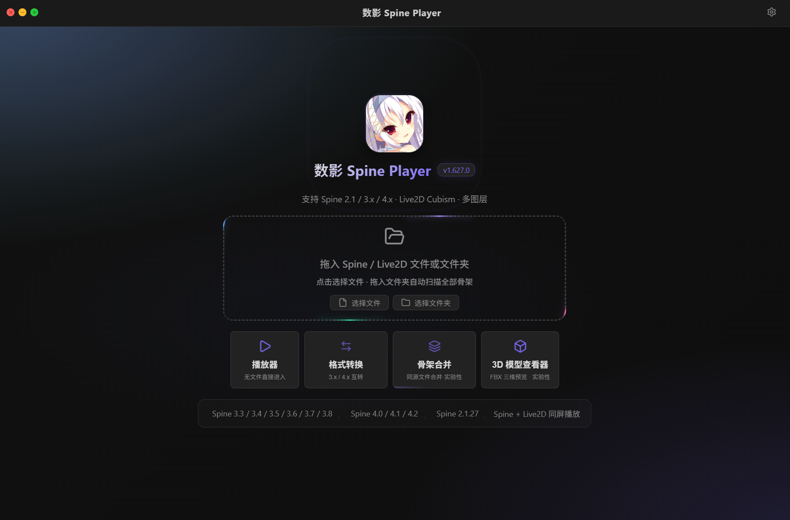

   
  <h1>数影 Spine Player</h1>
  

    <strong>跨平台非官方 2D 骨骼动画播放器</strong>
     
    多版本播放 · 格式转换 · 骨架合并 · Live2D · 3D 预览 · AI超分
  

  

    
    
    
    
     
    
    
    
    
    
     

  

   

---

## 📖 简介
  这是集**播放、格式转换、合并、超分**等等功能于一体的跨平台**非官方**骨骼动画播放器项目，支持MacOS（仅D-01-release）及Windows（未来仅支持），目前已实现从 **Spine 2.1** 到 **3.x** 到 **4.x** 的多版本兼容播放与指定格式转换，同时支持 Live2D Cubism 2/4 和 Unity FBX 3D 模型导入。

  

  
## ✨ 功能特性
### 🎬 播放器核心
| 功能 | 说明 |
|------|------|
| **Spine 多版本支持** | 2.1 / 3.x / 4.x |
| **Live2D 多版本支持** | Cubism 2 / 4 |
| **Spine 双引擎渲染** | Enhanced（统一转换型） / Native（双播放器核心兼容型）|
| **多图层叠加** | 多个 Spine/Live2D 文件同屏播放，独立缩放及拖拽排序 |
| **动画控制** | 播放/暂停/停止，帧精确跳转，循环模式切换 |
| **皮肤/部件切换** | 实时切换角色皮肤、显示/隐藏部件 |
| **导出模块** | 支持PNG单帧导出，多种分辨率预设，AI 超分增强导出 |
---
## 🛠️ 技术栈
| 层面 | 技术 |
|------|------|
| **桌面框架** | [Tauri 2](https://v2.tauri.app/)（Rust + WebView2） |
| **前端框架** | [React 19](https://react.dev/) + TypeScript |
| **后端语言** | Rust |
---
## 🗺️ 更新日志
# D-02
1.多语言支持，支持中/英/日三语，切换即时生效。

2.liv2d支持，并且特别优化播放器相关组件，实现spine+l2d同屏播放。呈现效果如下图所示：

  

3.FBX支持，呈现效果如下图所示：

  

4.导出功能支持。
# D-01
spine版本支持，合并模块仅限定于3.8，并且同源关系素材。
| 源 ↓ \ 目标 → | **3.8** | **4.0** | **4.1** | **4.2** |
|:-------------:|:-------:|:-------:|:-------:|:-------:|
| **2.1** | ✅ | ✅ | ✅ | ✅ |
| **3.6** | ✅ | ✅ | ✅ | ✅ |
| **3.7** | ✅ | ✅ | ✅ | ✅ |
| **3.8** | ✅ | ✅ | ✅ | ✅ |
| **4.0** | ✅ | ✅ | ✅ | ✅ |
| **4.1** | ✅ | ✅ | ✅ | ✅ |
| **4.2** | ✅ | ✅ | ✅ | ✅ |

---
## 🔄 后续计划
  目前尚在进行测试的模块:
 - [ ]  1.导出模块更多功能测试。
- [ ]   2.桌宠模块测试。
- [ ]   3.多主题功能测试。
---
> 如果遇到无法读取、错误、失败等案例，欢迎提出 Issue（最好附带文件）。  
> 项目地址：https://github.com/xingluo1909/shuying-spine-player
---
> D-02后基本功能大多完善，而现实工作繁忙，预计无限期暂缓维护，感谢使用。
